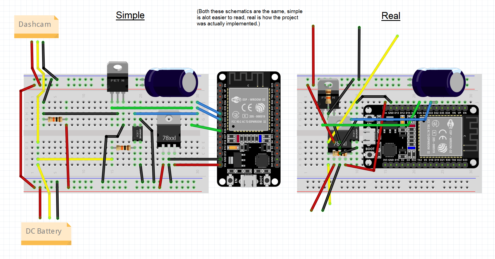

# Dashcam Shutoff

## Preamble

I have a *Blackvue DR900X Plus* 2 channel dashcam, paired with a *Blackvue B-130X* battery in my car.
This combination works great, and I can sleep sound knowing that my car battery will never be affected my the recording of my dashcam.
However there are periods of time where my car will not get driven for days while parked at home, and therefore the camera will record in parking mode off the power of the Blackvue battery until it runs out. This is fine, however this means that then if I take a quick 5 minute drive down to the shops, the battery will not charge back up enough for it to stay on while at the shops. I realised it was silly to have it recording while at home, recording nothing of importance, and then not have enough power to record while out, where it is important.

Since Blackvue does not have a geofencing feature within their software to turn off the dashcam while at home. I decided it was necessary to build a device that detects whether it is at home, and cuts the power to the dashcam if so in order to preserve battery power.

## The Device

### Main Components

- **ESP32** - This is the microcontroller for the logic of the project, and is programmed via a ESPHome script.
- **Optoisolator** - To detect whether the accessory power of the car is active (whether the engine is running).
- **MOSFET** - To turn the power to the dashcam on and off.

### Requirements

- If the engine is on, the dashcam must be on no matter what.
- When the dashcam is at home, and the car engine is off, the dashcam should be off.
- When the dashcam is away from home, and the car engine is off, the dashcam should enter parking mode and stay in until either the engine is turned back on or the battery runs out.
- The ESP device should sleep while the engine is off. Leaving it running would waste battery power, and therefore defeat the purpose of turning off the dashcam.
- There should be an override, to tell the device not to turn off the dashcam even if the car is parked at home.
- The completed solution should be able to placed neatly inside the car near the dashcam battery. Loose wiring or easily breakable connections would not stand up to the movements that happen inside a vehicle.

### Schematics

Photos of the real thing are located in the Pictures directory.

### Process of Creation

The accessory line goes to the dashcam and also to the optoisolator, through a 10K resistor. The optoisolator picks up the change (when the engine stops and starts) and relays this signal back to the ESP32. On the schematic, you will notice I have sent this same signal to two pins, this is because of how ESPHome handles pins, one is for the waking on deep sleep, and one is for actually reading the signal (on or off).

The main power and ground lines both go to a voltage regulator, changing the 12V from the car/batttery, to 5V which the ESP32 can use.

The MOSFET receives a signal from the ESP32, and turns the ground line to the dashcam on or off. The positive line is not affected.

Finally before reaching the dashcam, the positive and negative lines pass by a capacitor. This wasn't in my original plans, however I found that while the ESP was starting (a few milliseconds), the MOSFET would be closed, and the power to the dashcam would be cut. This keeps power for about a second, long enough to hold the dashcam's power during switch over.

Putting it all in a box was super easy since I found the board and box that match together on DigiKey. The board fits perfectly into the box, and the box lid screws right on. I only drilled a hole in two sides to let the power leads come out. I also bought some hook and loop tape so that the box would stick to the floor of the car.

### How it Works

#### Main Functions

The dashcam wakes upon a changes to the accessory power signal line (from the optoisolator). It will stay on until confirming one of the following situations, maximum around 3 minutes (self defined), at which point it will enter deep sleep..
- If the engine turns off, and the ESP can connect to the home wifi, the dashcam turns off.
- If the engine turns off, and the ESP can not connect to the home wifi, the dashcam stays on.
- If the engine turns on, the dashcam turns on, no matter what.

The above situations also apply too if the accessory power state changes, but the ESP has not entered deep sleep yet.

#### Extra Functions

- If the 'Block Sleep' virtual switch is true, it will perform all the required functions, but never enter deep sleep. 
- If the 'Block Power Off' virtual switch is true, it will perform all the required functions, but never power off the dashcam.

#### Accessibility

The interface for the ESP32 can be found by navigating to its IP address (this can include its multicast address, which is what ESPHome will usually provide you) on a browser and then logging in with the username and password that has been set. There, the virtual switches can be triggered, and the readouts of the devices can be found.

## Challenges

1. How would this device control the dashcam? If it is to sit between the battery and the dashcam, it would need to be have the same plugs as the dashcam and battery.
    - A fair amount of research went into finding out what male and female plugs would exactly match the plugs on the battery and the dashcam, and after a fair enough of reverse image searching and checking countless datasheets, I came across the Würth Elektronik power connectors (check DigiKey list). Although I am not sure that these are the *exact* connectors Blackvue used, they for sure are a good match and slot in nicely.
2. The dashcam still needs to retain all its original functionality. 
    - If placing this device inbetween the battery and the dashcam meant that features would be lost, it would not a good project. Testing the voltages and signals from the battery made sure that no data was being transferred from the battery to the dashcam, only power. This meant that the device would not be interupting any signals the dashcam was originally receiving.

## Results

The device seems to work as needed, and I do not see any changes in the dashcams functionality, other than the fact that it shuts down after about 2 minutes of being home and the engine off.

From the quick readings I have made (just by checking the battery level of the Blackvue battery with my phone) it would seem that the battery only drains around 20-30% battery over a 7 day period. This is a vast improvement on the 20 hours I would get, because the dashcam was running.

## Future Thoughts

The power drain can possibly be improved. After reading some forums and datasheets, I am aware that if the ESP is holding a pin's state during deep sleep, it can draw a large amount of power compared to deep sleep without holding a pin (around 10 times more?). I know this can be avoided by correctly laying out a circuit and/or using the correct MOSFET, but unfortunately my electronics is just not that good to know whether I have done that correctly.
Another way to save a tiny bit more power is to have the ESP not wake up after 48 hours (as is currently set).

The code can be very easily altered to allow Home Assistant to pick up the device, and log all the readouts. This probably would be useful if I wanted an easy way to check what the device has been doing.

Use the BlueTooth of the ESP32 to connect to the battery and check the battery's percentage. If the ESP is also connected to Home Assistant, it could then report this information to HomeAssistant and make an ongoing report of the battery level.

## Discussions

Use the discussions section of the repo on GitHub to suggest any improvements to the code, or anywhere where I may have misunderstood how something works, and have then in turn explained it terribly here.

Use the issues section of the repo on GitHub to explain any issues you may be facing with the ESPHome markup that I have written, or anything that just doesn't seem to be working right.

## Links

- [DigiKey Part List](https://www.digikey.com.au/en/mylists/list/G5RDV1HLS1) - All the parts that I used in the end to create this device (excluding the capacitor, I bought this from a local parts store). Although this is all I used, it would be recommended to get extras as spares incase things go wrong during building.

## Credits/References

- [dashcam-parkmode](https://github.com/Swap-File/dashcam-parkmode/tree/master) by Swap-File - A GitHub repo I came across from a [thread](https://www.rdforum.org/threads/99757/) talking about very similar problems to what I have described here, and that project very much formed the basis of my project here now.